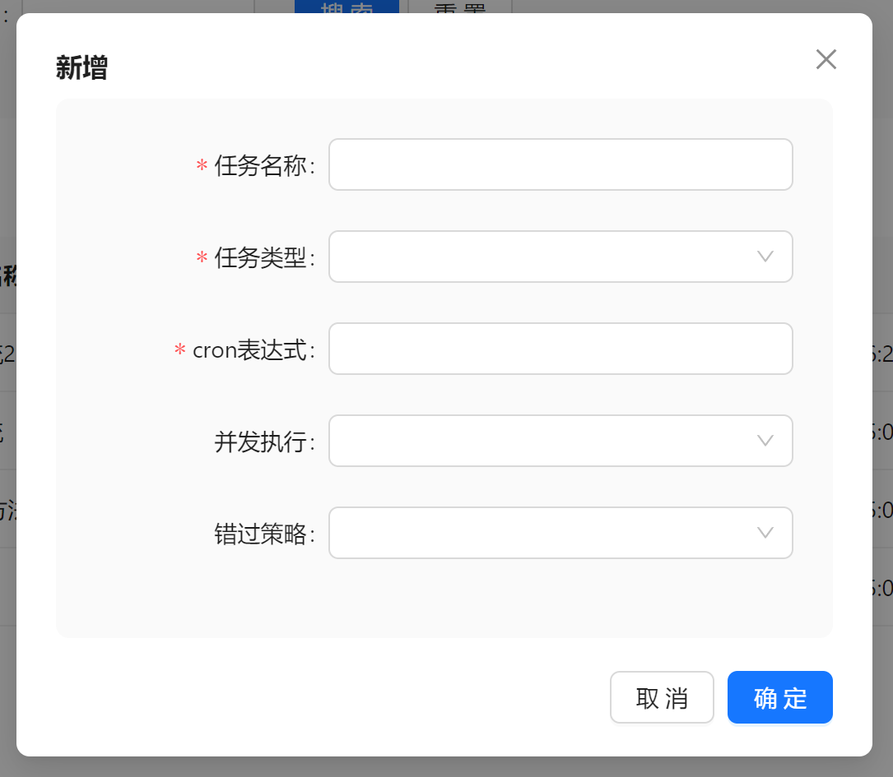
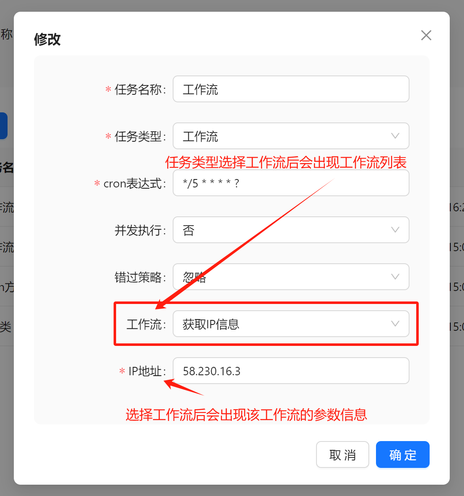
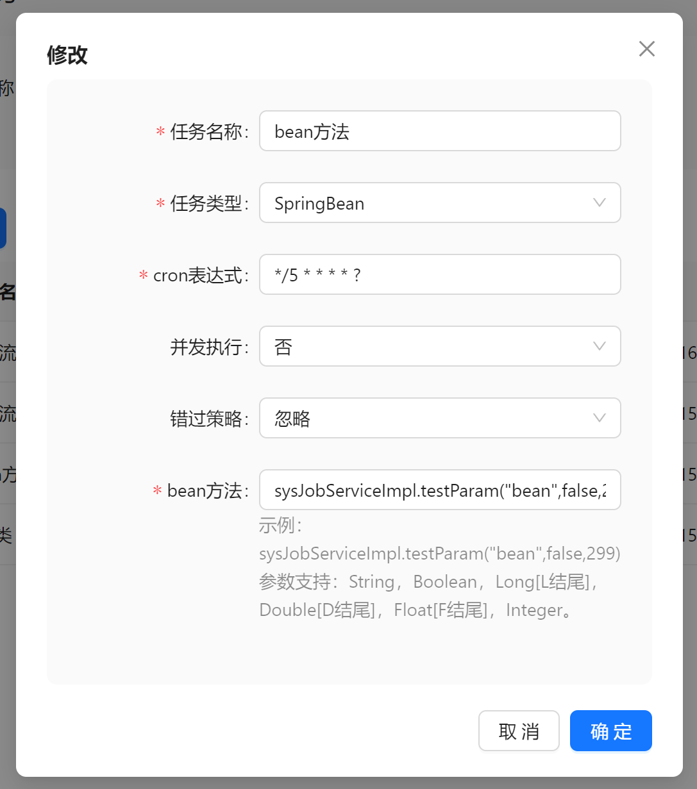
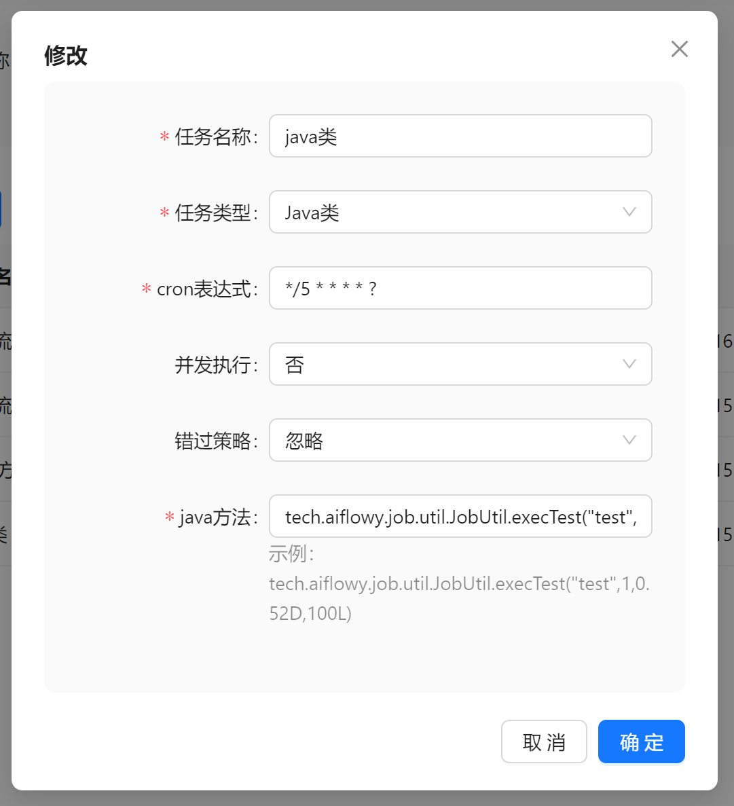

# 定时任务

AIFlowy 的定时任务是基于 quartz 来实现的，包含了三种类型的任务。

## 参数说明



- 任务名称：任务名称。
- 任务类型：工作流、SpringBean、Java类。
- cron 表达式：决定了定时任务执行的时间。
- 并发执行：同一个任务是否允许并发执行，否的话必须等待上一个任务执行完成，才能继续执行。
- 错过策略：
    - 立即触发：触发所有错过的任务。
    - 触发一次：触发最近一次错过的任务。
    - 忽略：忽略错过的任务。

## 任务类型

### 工作流



### SpringBean方法



> 参数支持：String，Boolean，Long[L结尾]，Double[D结尾]，Float[F结尾]，Integer。

示例：
```
sysJobServiceImpl.testParam("bean",false,299)
```

### Java类方法



> 参数支持：String，Boolean，Long[L结尾]，Double[D结尾]，Float[F结尾]，Integer。

示例：
```
tech.aiflowy.job.util.JobUtil.execTest("test",1,0.52D,100L)
```